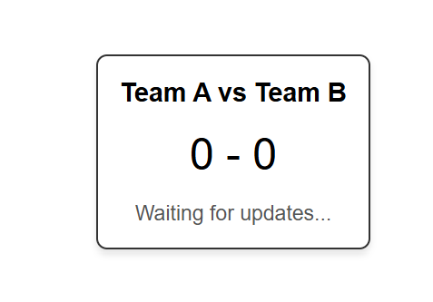
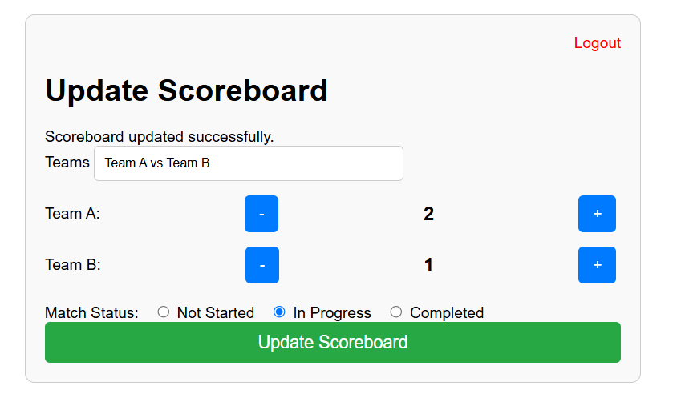

# Real-Time Football Score System using Laravel Broadcasting & WebSockets

This is a simple real-time football score update system built using Laravel and WebSockets. It simulates live score updates for a football match and broadcasts these updates to connected clients in real time.

## Requirements

- PHP 8.0+
- Composer
- Laravel 8+
- Node.js and npm
- Redis (optional, for broadcasting)


## Installation Steps

### 1. Clone the project

First, clone the project if you don't have one yet:

```
 git clone https://github.com/4kasun/football-score-system.git
```

### 2. Update the environment

ducplicate the .env.example file and fill the database details then

```
php artisan migrate
```

### 3. installing Broadcasting

follow the instrucion and install reverb.

```
php artisan install:broadcasting

```

### 4. Run the project
   1. Open new 4 terminals and run followin commands in each

   ```
    php artisan reverb:start

    php artisan queue:work

    php artisan serve

    npm run dev
   ```
   2. open two browser window and enter `http://localhost:8000` or if you have verual host please enta that.

    
   
   3. in other broser enter `http://localhost/register` and create a new user and log in.

   


